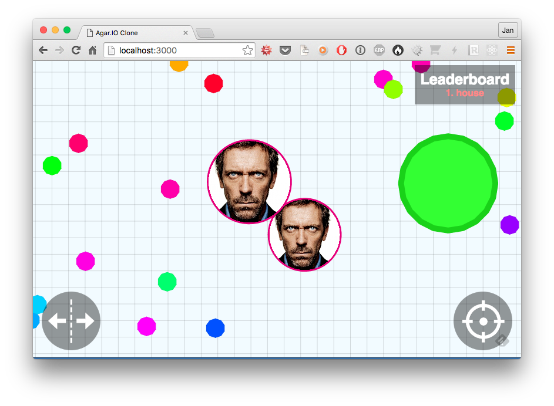

Agar.io Faces
=============

Simple extension of great [huytd/agar.io-clone](https://github.com/huytd/agar.io-clone) which renders faces onto player characters.



## Added features
- Place photos to ``/faces`` folder, and they will show in player bubble with corresponding nickname<-->filename.
- Gulp task ``gulp crop-faces`` should be used to circulaly crop faces and move them to public location.
- You can use ``faces-mapping.json`` file to specify automatic photo rename to username format (eg. from id to username).
- Username can be predefinned using ``?username=`` URL parameter

#### New requirements
You will need ImageMagic (``convert`` excutable) installed in order to use automatic circullar faces cropping ability. Installation procedure:

On Ubuntu
```
$ apt-get install ImageMagick
```
On Mac OS X
```
$ brew install ImageMagick
```
On CentOS
```
$ yum install ImageMagick
```
